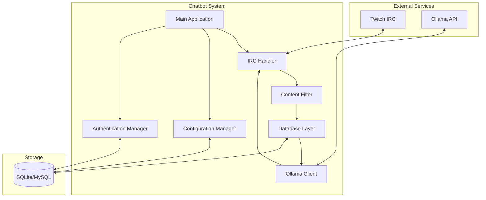

# Design Document - Twitch Ollama Chatbot

## Overview

This document outlines the technical design for a Python-based Twitch chatbot that integrates with Ollama to generate contextually relevant chat messages. The system operates across multiple channels simultaneously, learning from each channel's unique conversation patterns to generate natural, irreverent messages that fit the Twitch chat culture.

## Architecture

### High-Level Architecture



### Component Architecture

The system follows a modular architecture with six core components:

1. **IRC Handler** - Manages Twitch IRC connections and message events
2. **Ollama Client** - Handles AI model communication and response processing
3. **Database Layer** - Manages persistent storage and data operations
4. **Message Processor** - Coordinates message filtering, triggers, and generation
5. **Configuration Manager** - Handles settings and chat command processing
6. **Authentication Manager** - Manages OAuth tokens and bot identity

## Components and Interfaces

### 1. IRC Handler Module

**Purpose**: Manages all Twitch IRC communication and event handling.

**Key Classes**:
```python
class TwitchIRCClient:
    async def connect(self, channels: List[str]) -> None
    async def send_message(self, channel: str, message: str) -> None
    async def handle_message(self, channel: str, user: str, message: str) -> None
    async def handle_clearmsg(self, channel: str, message_id: str) -> None  # Single message deletion
    async def handle_clearchat_user(self, channel: str, user_id: str) -> None  # User timeout/ban
    async def handle_clearchat_all(self, channel: str) -> None  # Full chat clear
    
class MessageEvent:
    channel: str
    user_id: str
    user_display_name: str
    message_id: str
    content: str
    timestamp: datetime
```

**Responsibilities**:
- Maintain persistent IRC connections to multiple channels
- Parse incoming messages and moderation events
- Handle reconnection with exponential backoff
- Route events to the Message Processor
- Send generated messages to appropriate channels

### 2. Ollama Client Module

**Purpose**: Interfaces with Ollama API for message generation.

**Key Classes**:
```python
class OllamaClient:
    def __init__(self, base_url: str, timeout: int = 30)
    async def generate_message(self, model: str, context: List[str], user_input: str = None) -> str
    async def validate_model(self, model: str) -> bool
    def format_context(self, messages: List[Message]) -> str
    def validate_response(self, response: str) -> str
    
class GenerationRequest:
    model: str
    context_messages: List[str]
    user_input: Optional[str]
    max_length: int = 500
```

**Responsibilities**:
- Format chat context for Ollama prompts
- Make HTTP requests to Ollama API with timeout handling
- Validate and format AI responses
- Ensure messages comply with 500-character Twitch limit
- Handle model switching per channel

**System Prompt**:
```
Generate a single casual chat message that fits naturally with the recent conversation. 
Be conversational and match the tone of recent messages. Keep it under 500 characters 
and avoid special formatting. Generate only the message content, nothing else.
```

### 3. Database Layer Module

**Purpose**: Manages all persistent storage operations.

**Schema Design**:
```sql
-- Core message storage
CREATE TABLE messages (
    id INTEGER PRIMARY KEY AUTOINCREMENT,
    message_id TEXT UNIQUE NOT NULL,
    channel TEXT NOT NULL,
    user_id TEXT NOT NULL,
    user_display_name TEXT NOT NULL,
    message_content TEXT NOT NULL,
    timestamp DATETIME NOT NULL,
    INDEX idx_channel_timestamp (channel, timestamp),
    INDEX idx_message_id (message_id),
    INDEX idx_user_id (user_id)
);

-- Channel-specific configuration
CREATE TABLE channel_config (
    channel TEXT PRIMARY KEY,
    message_threshold INTEGER DEFAULT 30,
    time_delay INTEGER DEFAULT 300,
    context_limit INTEGER DEFAULT 200,
    ollama_model TEXT,
    message_count INTEGER DEFAULT 0,
    last_bot_message DATETIME,
    created_at DATETIME DEFAULT CURRENT_TIMESTAMP,
    updated_at DATETIME DEFAULT CURRENT_TIMESTAMP
);

-- OAuth token storage
CREATE TABLE auth_tokens (
    id INTEGER PRIMARY KEY,
    access_token TEXT NOT NULL,
    refresh_token TEXT,
    expires_at DATETIME,
    bot_username TEXT,
    created_at DATETIME DEFAULT CURRENT_TIMESTAMP
);
```

**Key Classes**:
```python
class DatabaseManager:
    async def store_message(self, message: MessageEvent) -> None
    async def get_recent_messages(self, channel: str, limit: int) -> List[Message]
    async def delete_message_by_id(self, message_id: str) -> None  # CLEARMSG event
    async def delete_user_messages(self, channel: str, user_id: str) -> None  # CLEARCHAT user event
    async def clear_channel_messages(self, channel: str) -> None  # CLEARCHAT all event
    async def cleanup_old_messages(self, channel: str, retention_days: int) -> None
    
class ChannelConfigManager:
    async def get_config(self, channel: str) -> ChannelConfig
    async def update_config(self, channel: str, key: str, value: Any) -> None
    async def increment_message_count(self, channel: str) -> int
    async def reset_message_count(self, channel: str) -> None
```

### 4. Message Processor Module

**Purpose**: Coordinates message filtering, generation triggers, and AI interaction.

**Key Classes**:
```python
class MessageProcessor:
    def __init__(self, db: DatabaseManager, ollama: OllamaClient, filter: ContentFilter, irc: TwitchIRCClient)
    
    async def process_incoming_message(self, event: MessageEvent) -> None:
        # Simple coordinator: filter → store → check trigger → maybe generate
    async def handle_moderation_event(self, event: ModerationEvent) -> None:
        # Clean up database when users are banned or messages deleted
    
class ContentFilter:
    def filter_input(self, message: str) -> Optional[str]
    def filter_output(self, message: str) -> Optional[str]
    def load_blocked_words(self, file_path: str) -> None
    
# Trigger logic integrated into IRC Handler and Database operations
# Uses asyncio events to coordinate generation when thresholds are met
```

**Message Processing Flow**:
1. IRC Handler receives message
2. Content Filter processes message (returns None if blocked)
3. Database stores filtered message and increments channel message count
4. Trigger Manager checks count/time thresholds
5. If triggered: Database provides context → Ollama generates response → IRC Handler sends
6. Reset message count after successful generation

### 5. Configuration Manager Module

**Purpose**: Manages global and per-channel settings.

**Key Classes**:
```python
class ConfigurationManager:
    def __init__(self, db: DatabaseManager)
    
    async def process_chat_command(self, channel: str, user: str, command: str) -> str
    async def get_channel_setting(self, channel: str, key: str) -> Any
    async def set_channel_setting(self, channel: str, key: str, value: Any) -> bool
    def validate_setting_value(self, key: str, value: str) -> bool
    
class GlobalConfig:
    ollama_url: str
    ollama_model: str
    database_url: str
    twitch_client_id: str
    twitch_client_secret: str
    channels: List[str]
```

**Chat Commands**:
- `!clank threshold` - Show current message threshold
- `!clank threshold 45` - Set message threshold to 45
- `!clank delay` - Show current time delay
- `!clank delay 300` - Set time delay to 300 seconds
- `!clank context` - Show current context window size
- `!clank context 150` - Set context window to 150 messages
- `!clank model` - Show current Ollama model
- `!clank model llama3.1` - Set Ollama model to llama3.1

### 6. Authentication Manager Module

**Purpose**: Handles OAuth authentication and token management.

**Key Classes**:
```python
class AuthenticationManager:
    async def authenticate(self) -> bool
    async def refresh_token(self) -> bool
    async def get_bot_username(self) -> str
    async def store_tokens(self, access_token: str, refresh_token: str, expires_at: datetime) -> None
    async def load_stored_tokens(self) -> Optional[TokenData]
    
class TokenData:
    access_token: str
    refresh_token: str
    expires_at: datetime
    bot_username: str
```

## Data Models

### Core Data Structures

```python
@dataclass
class Message:
    id: int
    message_id: str
    channel: str
    user_id: str
    user_display_name: str
    content: str
    timestamp: datetime

@dataclass
class ChannelConfig:
    channel: str
    message_threshold: int = 30
    time_delay: int = 300  # seconds
    context_limit: int = 200
    ollama_model: Optional[str] = None
    message_count: int = 0
    last_bot_message: Optional[datetime] = None

@dataclass
class GenerationContext:
    channel: str
    recent_messages: List[Message]
    user_input: Optional[str] = None
    is_mention: bool = False
```

### Message Generation Logic

```python
async def should_generate_message(self, channel: str) -> bool:
    config = await self.db.get_channel_config(channel)
    
    # Check message count threshold
    if config.message_count < config.message_threshold:
        return False
    
    # Check time delay
    if config.last_bot_message:
        time_since_last = datetime.now() - config.last_bot_message
        if time_since_last.total_seconds() < config.time_delay:
            return False
    
    # Check adequate context
    message_count = await self.db.count_recent_messages(channel)
    if message_count < 10:  # Minimum context for quality generation
        return False
    
    return True
```

## Error Handling

### Graceful Degradation Strategy

**Ollama Unavailable**:
- Skip generation attempts
- Log errors with context
- Continue monitoring chat
- Resume when service returns

**Database Errors**:
- Retry with exponential backoff
- Fall back to in-memory storage temporarily
- Alert on persistent failures

**IRC Disconnection**:
- Auto-reconnect with backoff
- Rejoin all configured channels
- Preserve message counts and timestamps

**Content Filtering Failure**:
- Default to blocking suspicious content
- Log failures for investigation
- Never send unfiltered content

### Error Response Patterns

```python
class ErrorHandler:
    async def handle_ollama_error(self, error: Exception, channel: str) -> None:
        logger.warning("Ollama request failed", extra={
            "channel": channel,
            "error": str(error),
            "error_type": type(error).__name__
        })
        # Skip this generation cycle
    
    async def handle_database_error(self, error: Exception) -> None:
        logger.error("Database operation failed", extra={
            "error": str(error),
            "retry_count": self.retry_count
        })
        await asyncio.sleep(2 ** self.retry_count)  # Exponential backoff
```

## Testing Strategy

### Unit Testing

**Message Processor Tests**:
```python
class TestMessageProcessor:
    async def test_content_filtering_blocks_inappropriate():
        # Test that inappropriate content is filtered
        
    async def test_mention_detection_case_insensitive():
        # Test mention detection works regardless of case
        
    async def test_generation_trigger_respects_thresholds():
        # Test that generation only happens when thresholds are met
```

**Database Tests**:
```python
class TestDatabaseManager:
    async def test_channel_isolation():
        # Test that messages are properly isolated by channel
        
    async def test_message_cleanup():
        # Test that old messages are properly cleaned up
```

### Integration Testing

- Test full message flow from IRC to Ollama and back
- Test database operations with real SQLite/MySQL
- Test OAuth token refresh cycle
- Test multi-channel operation
- Test error recovery scenarios

### Performance Testing

- Context retrieval performance with 10,000+ messages
- Memory usage during extended operation
- Concurrent channel handling
- Database query optimization validation

## Deployment

### Environment Configuration

```bash
# Required environment variables
OLLAMA_URL=http://localhost:11434
OLLAMA_MODEL=llama3.1
OLLAMA_TIMEOUT=30

# Database configuration (SQLite)
DATABASE_TYPE=sqlite
DATABASE_URL=./chatbot.db

# Database configuration (MySQL)
# DATABASE_TYPE=mysql
# MYSQL_HOST=localhost
# MYSQL_PORT=3306
# MYSQL_USER=chatbot
# MYSQL_PASSWORD=secure_password
# MYSQL_DATABASE=twitch_bot

TWITCH_CLIENT_ID=your_client_id
TWITCH_CLIENT_SECRET=your_client_secret
TWITCH_CHANNELS=channel1,channel2,channel3

CONTENT_FILTER_ENABLED=true
BLOCKED_WORDS_FILE=./blocked_words.txt

LOG_LEVEL=INFO
```

### Startup Sequence

1. Load environment configuration
2. Initialize database connection and run migrations
3. Load or refresh OAuth tokens
4. Connect to Ollama and validate default model
5. Connect to Twitch IRC
6. Join configured channels
7. Load channel configurations and message history
8. Start message processing loop

### Graceful Shutdown Handling

**Signal Handling**:
```python
class ApplicationManager:
    def __init__(self):
        self.shutdown_event = asyncio.Event()
        self.components = []  # List of components to shutdown
    
    def setup_signal_handlers(self):
        signal.signal(signal.SIGINT, self._signal_handler)
        signal.signal(signal.SIGTERM, self._signal_handler)
    
    def _signal_handler(self, signum, frame):
        logger.info(f"Received signal {signum}, initiating graceful shutdown")
        asyncio.create_task(self.shutdown())
    
    async def shutdown(self):
        self.shutdown_event.set()
        
        # Shutdown components in reverse order
        for component in reversed(self.components):
            try:
                await component.shutdown()
                logger.info(f"Successfully shutdown {component.__class__.__name__}")
            except Exception as e:
                logger.error(f"Error shutting down {component.__class__.__name__}: {e}")
```

**Component Shutdown Interface**:
```python
class ShutdownMixin:
    async def shutdown(self) -> None:
        """Gracefully shutdown the component"""
        pass

class TwitchIRCClient(ShutdownMixin):
    async def shutdown(self) -> None:
        logger.info("Shutting down IRC client")
        if self.connection:
            await self.connection.close()
        
class DatabaseManager(ShutdownMixin):
    async def shutdown(self) -> None:
        logger.info("Shutting down database connections")
        if self.connection_pool:
            await self.connection_pool.close()
        
class OllamaClient(ShutdownMixin):
    async def shutdown(self) -> None:
        logger.info("Shutting down Ollama client")
        if self.session:
            await self.session.close()
```

**Shutdown Sequence**:
1. Set shutdown event to stop new operations
2. Complete any in-flight message generation
3. Close IRC connections gracefully
4. Flush any pending database operations
5. Close database connections
6. Close HTTP sessions (Ollama client)
7. Log shutdown completion

### Production Considerations

- Use connection pooling for MySQL deployments
- Implement log rotation and monitoring
- Set up health checks for Ollama connectivity
- Monitor memory usage and implement cleanup
- Use systemd service for automatic restart
- Handle SIGTERM/SIGINT signals for graceful shutdown

## Security Considerations

### Token Security
- Store OAuth tokens encrypted in database
- Never log sensitive authentication data
- Implement secure token refresh cycle
- Use environment variables for secrets

### Input Validation
- Validate all chat commands and parameters
- Sanitize database inputs to prevent injection
- Limit configuration values to reasonable ranges
- Validate Ollama model names against allowed list

### Content Safety
- Always apply content filtering before storage
- Log blocked content for analysis (without storing)
- Implement fail-safe blocking when filters unavailable
- Respect moderation actions immediately

This design provides a robust, scalable foundation for the Twitch Ollama chatbot that meets all requirements while maintaining clean architecture and security best practices.