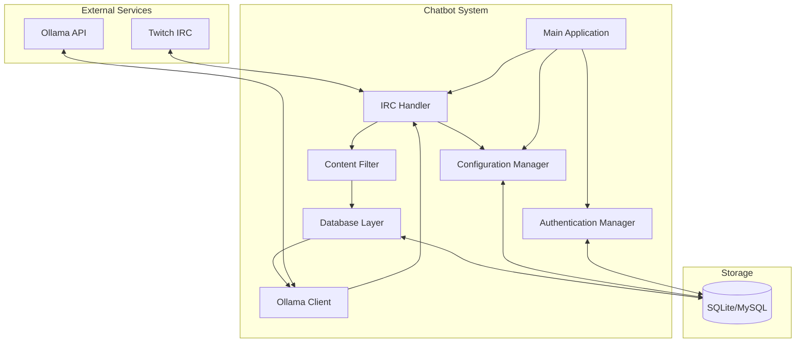

# Design Document - Twitch Ollama Chatbot

## Overview

This document outlines the technical design for a Python-based Twitch chatbot that integrates with Ollama to generate contextually relevant chat messages. The system operates across multiple channels simultaneously, learning from each channel's unique conversation patterns to generate natural, irreverent messages that fit the Twitch chat culture.

## Architecture

### High-Level Architecture



### Component Architecture

The system follows a modular architecture with six core components:

1. **IRC Handler** - Manages Twitch IRC connections and message events
2. **Ollama Client** - Handles AI model communication and response processing
3. **Database Layer** - Manages persistent storage and data operations
4. **Message Processor** - Coordinates message filtering, triggers, and generation
5. **Configuration Manager** - Handles settings and chat command processing
6. **Authentication Manager** - Manages OAuth tokens and bot identity

## Components and Interfaces

### 1. IRC Handler Module

**Purpose**: Manages all Twitch IRC communication and event handling.

**Key Classes**:
```python
class TwitchIRCClient(twitchio.Bot):
    def __init__(self, token: str, bot_username: str, known_bots: List[str], initial_channels: List[str])
    async def event_ready(self) -> None  # Bot connected and ready
    async def event_message(self, message: twitchio.Message) -> None  # Handle incoming messages
    async def event_raw_data(self, data: str) -> None  # Handle raw IRC events (CLEARMSG, CLEARCHAT)
    async def send_message(self, channel: str, message: str) -> None
    async def handle_chat_command(self, message: twitchio.Message) -> None  # Process !clank commands
    async def handle_clearmsg(self, channel: str, message_id: str) -> None  # Single message deletion
    async def handle_clearchat_user(self, channel: str, user_id: str) -> None  # User timeout/ban
    async def handle_clearchat_all(self, channel: str) -> None  # Full chat clear
    def is_bot_message(self, username: str) -> bool  # Check if message is from this bot or other known bots
    def is_system_message(self, message: twitchio.Message) -> bool  # Check if message is from Twitch system
    
class MessageEvent:
    channel: str
    user_id: str
    user_display_name: str
    message_id: str
    content: str
    timestamp: datetime
    badges: Dict[str, str]  # Twitch IRC badges (e.g., {"broadcaster": "1", "moderator": "1"})
    
    @classmethod
    def from_twitchio_message(cls, message: twitchio.Message) -> 'MessageEvent':
        """Convert TwitchIO message to internal MessageEvent"""
        return cls(
            channel=message.channel.name,
            user_id=message.author.id,
            user_display_name=message.author.display_name,
            message_id=message.id,
            content=message.content,
            timestamp=datetime.now(),
            badges=message.author.badges or {}
        )
```

**Responsibilities**:
- Maintain persistent IRC connections to multiple channels
- Parse incoming messages and moderation events
- **Parse Twitch IRC tags** to extract user badges, message IDs, and other metadata
- **Detect and route chat commands** (e.g., `!clank` commands) to Configuration Manager with user authorization
- Handle reconnection with exponential backoff
- Route regular messages to the Message Processor
- Send generated messages and command responses to appropriate channels

**TwitchIO Library Choice**:
Using TwitchIO (twitchio>=2.0.0) as the IRC library provides:
- **Automatic tag parsing**: All Twitch IRC metadata automatically parsed into Python objects
- **Built-in OAuth**: Handles Twitch authentication and token management
- **Event system**: Clean async event handlers for messages, moderation events, etc.
- **Rate limiting**: Built-in Twitch rate limit compliance
- **Reconnection**: Automatic reconnection handling with exponential backoff

**TwitchIO Message Object**:
```python
# TwitchIO automatically provides:
message.author.badges          # Dict of user badges
message.id                     # Unique message ID
message.author.id              # User ID for ban tracking
message.author.display_name    # User's display name
message.content                # Message text
message.channel.name           # Channel name
```

**Message Filtering Logic**:
Only regular user messages are stored and counted. The following are ignored:
- **Bot's own messages**: Detected by comparing username to bot's authenticated username
- **Other chatbots**: Detected using configurable list of known bot usernames (Nightbot, StreamElements, etc.)
- **System messages**: Twitch notifications for follows, subs, raids, etc. (detected via IRC message type or sender)
- **Filtered messages**: Messages blocked by content filter are never stored

**Bot Detection Implementation**:
```python
def is_bot_message(self, username: str) -> bool:
    """Check if message should be ignored (from bots)"""
    username_lower = username.lower()
    
    # Check if it's our own bot
    if username_lower == self.bot_username.lower():
        return True
    
    # Check against known bot list
    for bot_name in self.known_bots:
        if username_lower == bot_name.lower():
            return True
    
    return False

def is_system_message(self, message: twitchio.Message) -> bool:
    """Check if message is from Twitch system using TwitchIO"""
    # System messages in TwitchIO typically don't have author.id or are special types
    return message.author is None or message.author.id is None
```

### 2. Ollama Client Module

**Purpose**: Interfaces with Ollama API for message generation.

**Key Classes**:
```python
class OllamaClient:
    def __init__(self, base_url: str, timeout: int = 30)
    async def generate_spontaneous_message(self, model: str, context: List[str]) -> str
    async def generate_response_message(self, model: str, context: List[str], user_input: str, user_name: str) -> str
    async def validate_model(self, model: str) -> bool
    async def list_available_models(self) -> List[str]  # Get all available models from Ollama
    async def validate_startup_model(self, model: str) -> None  # Raises exception if model unavailable at startup
    def format_context_for_spontaneous(self, messages: List[Message]) -> str
    def format_context_for_response(self, messages: List[Message], user_input: str, user_name: str) -> str
    def validate_response(self, response: str) -> str
    
class GenerationRequest:
    model: str
    context_messages: List[str]
    user_input: Optional[str]
    max_length: int = 500
```

**Responsibilities**:
- Format chat context for different prompt types (spontaneous vs response)
- Make HTTP requests to Ollama API with timeout handling
- Validate and format AI responses
- Ensure messages comply with 500-character Twitch limit
- Handle model switching per channel
- Apply appropriate system prompts based on generation context

**System Prompts**:

*Spontaneous Message Prompt*:
```
Generate a single casual chat message that fits naturally with the recent conversation. 
Be conversational and match the tone of recent messages. Don't reference specific users 
or respond to anyone directly - just add to the conversation naturally. Keep it under 
500 characters and avoid special formatting. Generate only the message content, nothing else.
```

*Response Message Prompt*:
```
Generate a single casual response to the user's message, considering the recent chat context. 
Be conversational and match the tone of the chat. Address the user's input naturally but 
don't be overly formal. Keep it under 500 characters and avoid special formatting. 
Generate only the response content, nothing else.
```

## Prompt Engineering Strategy

### Context Formatting Differences

**Spontaneous Message Context**:
```
Recent chat messages:
[User1]: Hey everyone!
[User2]: what's up
[User3]: just chilling, you?

Generate a natural chat message that fits the conversation.
```

**Response Message Context**:
```
Recent chat messages:
[User1]: Hey everyone!
[User2]: what's up
[User3]: just chilling, you?
[BotName]: User3 mentioned you, what do you think about the new game?

Generate a response to User3's message: "just chilling, you?"
```

### Prompt Selection Logic

```python
async def generate_message(self, channel: str, is_mention: bool = False, 
                          user_input: str = None, user_name: str = None) -> str:
    """Generate appropriate message based on context"""
    
    context_messages = await self.db.get_recent_messages(channel, limit=config.context_limit)
    
    if is_mention and user_input and user_name:
        # Use response prompt for mentions
        return await self.ollama.generate_response_message(
            model=config.ollama_model,
            context=context_messages,
            user_input=user_input,
            user_name=user_name
        )
    else:
        # Use spontaneous prompt for automatic generation
        return await self.ollama.generate_spontaneous_message(
            model=config.ollama_model,
            context=context_messages
        )
```

### Prompt Design Rationale

**Spontaneous Messages**:
- Focus on natural conversation flow
- Avoid direct responses to specific users
- Encourage general chat participation
- Match the energy and tone of recent messages

**Response Messages**:
- Acknowledge the specific user and their input
- Maintain conversational tone (not robotic)
- Consider both the user's message and recent context
- Provide relevant, engaging responses

**Common Elements**:
- 500-character limit for Twitch compliance
- No special formatting (bold, italics, etc.)
- Casual, conversational tone
- Context-aware generation

## Rate Limiting Strategy

### Two Independent Cooldown Systems

**Spontaneous Message Cooldown (Channel-Level)**:
- Default: 5 minutes (300 seconds)
- Applies only to automatic message generation
- Configurable via `!clank spontaneous <seconds>`
- Tracked per channel in `last_spontaneous_message` timestamp
- Does NOT affect mention responses

**Response Message Cooldown (Per-User)**:
- Default: 1 minute (60 seconds) 
- Applies to mention responses on a per-user basis
- Configurable per channel via `!clank response <seconds>`
- Tracked per user per channel in `user_response_cooldowns` table
- Prevents same user from spamming mentions

### Rate Limiting Logic

```python
async def should_generate_spontaneous_message(self, channel: str) -> bool:
    """Check if spontaneous generation should trigger"""
    config = await self.get_channel_config(channel)
    
    # Check message count threshold
    if config.message_count < config.message_threshold:
        return False
    
    # Check spontaneous cooldown
    if config.last_spontaneous_message:
        time_since = datetime.now() - config.last_spontaneous_message
        if time_since.total_seconds() < config.spontaneous_cooldown:
            return False
    
    # Check adequate context
    available_messages = await self.db.count_recent_messages(channel)
    if available_messages < 10:
        return False
    
    return True

async def can_respond_to_mention(self, channel: str, user_id: str) -> bool:
    """Check if bot can respond to this user's mention"""
    config = await self.get_channel_config(channel)
    
    # Get user's last response time
    last_response = await self.db.get_user_last_response(channel, user_id)
    
    if last_response:
        time_since = datetime.now() - last_response
        if time_since.total_seconds() < config.response_cooldown:
            return False
    
    return True
```

### Configuration Commands (No Rate Limiting)

**Trusted User Commands**:
- `!clank` commands are only available to broadcasters and moderators
- No rate limiting applied to configuration commands
- Trusted users are expected to use commands responsibly
- Commands provide immediate feedback on configuration changes

### Cooldown Independence

**Key Design Principle**: Spontaneous and response cooldowns are completely independent:
- Generating a spontaneous message does NOT affect response cooldowns
- Responding to a mention does NOT affect spontaneous cooldown
- Each system tracks its own timestamps separately
- Users can still get responses during spontaneous cooldown periods
- Bot can still generate spontaneous messages while users are on response cooldown

### Ollama Rate Limiting Assessment

**No Ollama rate limiting needed because**:
- Bot generates at most one message per channel per cooldown period
- Multiple channels would generate concurrent requests, but that's expected behavior
- Ollama timeout (30s default) handles slow responses
- If Ollama is overloaded, requests will timeout and be skipped gracefully
- No scenario where bot would spam Ollama with requests

## Configuration Management Strategy

### Two-Tier Configuration System

**Global Configuration (Environment Variables)**:
- Requires application restart to change
- Covers infrastructure settings that rarely change
- Examples: Database connection, Ollama URL, OAuth credentials, default model
- Simple, reliable, no hot-reloading complexity

**Per-Channel Configuration (Database + Chat Commands)**:
- Changes take effect immediately via `!clank` commands
- Covers operational settings that may need tuning
- Examples: Message thresholds, cooldowns, context limits, channel-specific models
- Stored in database, persists across restarts

### Configuration Change Workflow

**Global Settings Changes**:
1. Update environment variables
2. Restart application
3. Bot loads new global configuration on startup

**Channel Settings Changes**:
1. Use `!clank` command in chat (broadcaster/mod only)
2. Setting updates immediately in database
3. Bot uses new setting for next operations
4. No restart required

### Design Rationale

**Why No Hot Reloading for Global Settings**:
- **Simplicity**: Avoids complex file watching and reload logic
- **Reliability**: Restart ensures clean state and proper validation
- **Infrequent changes**: Global settings rarely change in production
- **Clear boundaries**: Separates infrastructure config from operational config
- **Future flexibility**: Can add hot reloading later if needed without breaking changes

**Benefits of This Approach**:
- **Predictable behavior**: Clear distinction between restart-required and immediate changes
- **Easier debugging**: No complex state management for configuration reloading
- **Safer operations**: Global changes require intentional restart, preventing accidental disruption
- **Simpler implementation**: Focus on core functionality rather than configuration complexity

## Logging Strategy

### Log Levels and Events

**INFO Level**:
- Bot startup and shutdown events
- Channel connections and disconnections
- Message generation events (successful)
- Configuration changes via chat commands
- Authentication events (successful)
- Performance milestones (messages processed, uptime)

**WARNING Level**:
- Ollama API timeouts or slow responses (>10s)
- Content filtering blocks (with blocked content for analysis)
- Rate limit hits (user or spontaneous cooldowns)
- Model validation failures during runtime
- Database connection issues (before retry)
- IRC reconnection attempts

**ERROR Level**:
- Database connection failures
- Authentication failures
- Ollama API errors
- Critical startup failures
- Unhandled exceptions
- Configuration validation errors

**DEBUG Level** (Development Only):
- Individual message processing details
- Context window building
- Database query details
- Detailed Ollama request/response data

### Log Format and Structure

**Production Format (JSON)**:
```json
{
  "timestamp": "2024-01-15T10:30:45.123Z",
  "level": "INFO",
  "event_type": "message_generated",
  "channel": "examplechannel",
  "user_id": "12345",
  "user_display_name": "ExampleUser",
  "message_id": "abc-123-def",
  "message_content": "hey everyone!",
  "generation_type": "spontaneous",
  "response_time_ms": 2500,
  "model_used": "llama3.1"
}
```

**Development Format (Console)**:
```
2024-01-15 10:30:45 INFO [examplechannel] Generated spontaneous message (2.5s, llama3.1)
2024-01-15 10:30:46 WARN [examplechannel] Content filter blocked message from user12345: "inappropriate content here"
2024-01-15 10:30:47 ERROR Database connection failed, retrying in 2s (attempt 1/3)
```

### Logging Implementation

```python
import logging
import json
from datetime import datetime
from typing import Dict, Any

class StructuredLogger:
    def __init__(self, name: str, level: str = "INFO", format_type: str = "json"):
        self.logger = logging.getLogger(name)
        self.logger.setLevel(getattr(logging, level.upper()))
        self.format_type = format_type
        
        if format_type == "json":
            handler = logging.StreamHandler()
            handler.setFormatter(JsonFormatter())
        else:
            handler = logging.StreamHandler()
            handler.setFormatter(logging.Formatter(
                '%(asctime)s %(levelname)s [%(channel)s] %(message)s'
            ))
        
        self.logger.addHandler(handler)
    
    def info(self, message: str, **context):
        self._log("INFO", message, context)
    
    def warning(self, message: str, **context):
        self._log("WARNING", message, context)
    
    def error(self, message: str, **context):
        self._log("ERROR", message, context)
    
    def debug(self, message: str, **context):
        self._log("DEBUG", message, context)
    
    def _log(self, level: str, message: str, context: Dict[str, Any]):
        log_data = {
            "timestamp": datetime.utcnow().isoformat() + "Z",
            "level": level,
            "message": message,
            **context
        }
        
        if self.format_type == "json":
            self.logger.log(getattr(logging, level), json.dumps(log_data))
        else:
            self.logger.log(getattr(logging, level), message, extra=context)

class JsonFormatter(logging.Formatter):
    def format(self, record):
        return record.getMessage()
```

### Key Logging Events

**Message Processing**:
```python
# Successful generation
logger.info("Generated spontaneous message", 
    channel="examplechannel",
    generation_type="spontaneous",
    response_time_ms=2500,
    model_used="llama3.1",
    context_size=45
)

# Content filtering
logger.warning("Content filter blocked message",
    channel="examplechannel", 
    user_id="12345",
    user_display_name="ExampleUser",
    blocked_content="inappropriate message here",
    filter_reason="profanity"
)

# Rate limiting
logger.warning("User response rate limited",
    channel="examplechannel",
    user_id="12345", 
    user_display_name="ExampleUser",
    cooldown_remaining_seconds=45
)
```

**System Events**:
```python
# Startup
logger.info("Bot started successfully",
    channels=["channel1", "channel2"],
    default_model="llama3.1",
    database_type="sqlite"
)

# Configuration changes
logger.info("Channel configuration updated",
    channel="examplechannel",
    setting="spontaneous_cooldown",
    old_value=300,
    new_value=180,
    changed_by_user="moderator123"
)

# Errors
logger.error("Ollama API request failed",
    channel="examplechannel",
    model="llama3.1",
    error_type="timeout",
    request_duration_ms=30000
)
```

### Log Destinations and Rotation

**Development**:
- Console output with human-readable format
- DEBUG level enabled for detailed troubleshooting

**Production**:
- JSON format for structured logging
- File output with rotation (daily or size-based)
- INFO level default, configurable via LOG_LEVEL
- Optional integration with log aggregation systems

**Log Rotation Configuration**:
```python
import logging.handlers

# Rotate daily, keep 30 days
handler = logging.handlers.TimedRotatingFileHandler(
    filename='logs/chatbot.log',
    when='midnight',
    interval=1,
    backupCount=30
)
```

### Security Considerations

**Safe to Log**:
- Public chat message content (it's public data)
- User display names and user IDs
- Channel names
- Configuration values (except secrets)
- Performance metrics

**Never Log**:
- OAuth tokens or refresh tokens
- Database passwords
- API keys or secrets
- Internal system tokens

**Blocked Content Logging**:
- Log full blocked content for analysis and filter improvement
- Include context about why content was blocked
- Use WARNING level to make blocked content easily searchable

### 3. Database Layer Module

**Purpose**: Manages all persistent storage operations.

**Database Choice Strategy**:
- **User-driven selection**: Choice between SQLite and MySQL is entirely up to the end user
- **Default to SQLite**: If `DATABASE_TYPE` is unset or empty, defaults to SQLite
- **No auto-detection**: System uses exactly what's configured, no fallback logic
- **No migration tools**: Users are responsible for data migration if switching database types
- **Flexible deployment**: Both options use identical schema and operations

**Database Selection Logic**:
```python
def create_database_manager(config: Dict[str, str]) -> DatabaseManager:
    """Create appropriate database manager based on configuration"""
    db_type = config.get('DATABASE_TYPE', 'sqlite').lower()
    
    if db_type == 'mysql':
        return DatabaseManager(
            db_type='mysql',
            host=config['MYSQL_HOST'],
            port=int(config.get('MYSQL_PORT', 3306)),
            user=config['MYSQL_USER'],
            password=config['MYSQL_PASSWORD'],
            database=config['MYSQL_DATABASE']
        )
    else:  # Default to SQLite
        return DatabaseManager(
            db_type='sqlite',
            database_url=config.get('DATABASE_URL', './chatbot.db')
        )
```

**Schema Design**:
```sql
-- Core message storage
CREATE TABLE messages (
    id INTEGER PRIMARY KEY AUTOINCREMENT,
    message_id TEXT UNIQUE NOT NULL,
    channel TEXT NOT NULL,
    user_id TEXT NOT NULL,
    user_display_name TEXT NOT NULL,
    message_content TEXT NOT NULL,
    timestamp DATETIME NOT NULL,
    INDEX idx_channel_timestamp (channel, timestamp),
    INDEX idx_message_id (message_id),
    INDEX idx_user_id (user_id)
);

-- Channel-specific configuration
CREATE TABLE channel_config (
    channel TEXT PRIMARY KEY,
    message_threshold INTEGER DEFAULT 30,
    spontaneous_cooldown INTEGER DEFAULT 300,  -- 5 minutes default for spontaneous messages
    response_cooldown INTEGER DEFAULT 60,      -- 1 minute default for user response cooldown
    context_limit INTEGER DEFAULT 200,
    ollama_model TEXT,
    message_count INTEGER DEFAULT 0,
    last_spontaneous_message DATETIME,
    created_at DATETIME DEFAULT CURRENT_TIMESTAMP,
    updated_at DATETIME DEFAULT CURRENT_TIMESTAMP
);

-- Per-user response cooldowns (channel-specific)
CREATE TABLE user_response_cooldowns (
    id INTEGER PRIMARY KEY AUTOINCREMENT,
    channel TEXT NOT NULL,
    user_id TEXT NOT NULL,
    last_response_time DATETIME NOT NULL,
    UNIQUE(channel, user_id),
    INDEX idx_channel_user (channel, user_id)
);

-- Performance and monitoring metrics
CREATE TABLE bot_metrics (
    id INTEGER PRIMARY KEY AUTOINCREMENT,
    channel TEXT NOT NULL,
    metric_type TEXT NOT NULL, -- 'response_time', 'success_rate', 'error_count'
    metric_value REAL NOT NULL,
    timestamp DATETIME DEFAULT CURRENT_TIMESTAMP,
    INDEX idx_channel_metric_time (channel, metric_type, timestamp)
);

-- OAuth token storage
CREATE TABLE auth_tokens (
    id INTEGER PRIMARY KEY,
    access_token TEXT NOT NULL,
    refresh_token TEXT,
    expires_at DATETIME,
    bot_username TEXT,
    created_at DATETIME DEFAULT CURRENT_TIMESTAMP
);
```

**Key Classes**:
```python
class DatabaseManager:
    def __init__(self, db_type: str = "sqlite", **connection_params)  # Factory pattern for SQLite/MySQL
    async def store_message(self, message: MessageEvent) -> None
    async def get_recent_messages(self, channel: str, limit: int) -> List[Message]
    async def delete_message_by_id(self, message_id: str) -> None  # CLEARMSG event - single message deletion
    async def delete_user_messages(self, channel: str, user_id: str) -> None  # CLEARCHAT user event - purge all user messages
    async def clear_channel_messages(self, channel: str) -> None  # CLEARCHAT all event - clear entire channel
    async def cleanup_old_messages(self, channel: str, retention_days: int) -> None
    
class ChannelConfigManager:
    async def get_config(self, channel: str) -> ChannelConfig
    async def update_config(self, channel: str, key: str, value: Any) -> None
    async def increment_message_count(self, channel: str) -> int
    async def reset_message_count(self, channel: str) -> None
    async def update_spontaneous_timestamp(self, channel: str) -> None
    async def can_generate_spontaneous(self, channel: str) -> bool
    async def can_respond_to_user(self, channel: str, user_id: str) -> bool
    async def update_user_response_timestamp(self, channel: str, user_id: str) -> None
    async def load_persistent_state(self, channel: str) -> None  # Load message count and timestamps on startup
    async def save_persistent_state(self, channel: str) -> None  # Save state for restart continuity

class MetricsManager:
    async def record_response_time(self, channel: str, duration: float) -> None
    async def record_success(self, channel: str) -> None
    async def record_error(self, channel: str, error_type: str) -> None
    async def get_performance_stats(self, channel: str, hours: int = 24) -> Dict[str, Any]
    async def cleanup_old_metrics(self, retention_days: int = 7) -> None
```

### 4. Message Processor Module

**Purpose**: Coordinates message filtering, generation triggers, and AI interaction.

**Key Classes**:
```python
class MessageProcessor:
    def __init__(self, db: DatabaseManager, ollama: OllamaClient, filter: ContentFilter, irc: TwitchIRCClient)
    
    async def process_incoming_message(self, event: MessageEvent) -> None:
        # Simple coordinator: filter → store → check trigger → maybe generate
    async def handle_moderation_event(self, event: ModerationEvent) -> None:
        # Clean up database when users are banned or messages deleted
    
class ContentFilter:
    def __init__(self, blocked_words_file: str)
    def filter_input(self, message: str) -> Optional[str]  # Returns None if blocked
    def filter_output(self, message: str) -> Optional[str]  # Returns None if blocked
    def load_blocked_words(self, file_path: str) -> None

    def is_message_clean(self, message: str) -> bool
    def normalize_text(self, text: str) -> str  # Handle leetspeak, spacing tricks
    
# Trigger logic integrated into IRC Handler and Database operations
# Uses asyncio events to coordinate generation when thresholds are met
```

**Message Processing Flow**:
1. IRC Handler receives message
2. **If message is a chat command** (starts with `!clank`): Route to Configuration Manager → Send response back through IRC Handler
3. **If message is from bot or other chatbots**: Ignore completely (don't store or count)
4. **If message is from system** (raids, follows, subs): Ignore completely (don't store or count)
5. **If regular user message**: Content Filter processes message (returns None if blocked)
6. Database stores filtered message and increments channel message count
7. Trigger Manager checks count/time thresholds
8. If triggered: Database provides context → Ollama generates response → IRC Handler sends
9. Reset message count after successful generation (bot's own message is not stored or counted)

### 5. Configuration Manager Module

**Purpose**: Manages global and per-channel settings.

**Key Classes**:
```python
class ConfigurationManager:
    def __init__(self, db: DatabaseManager, auth: AuthenticationManager)
    
    async def process_chat_command(self, channel: str, user: str, command: str) -> str
    async def get_channel_setting(self, channel: str, key: str) -> Any
    async def set_channel_setting(self, channel: str, key: str, value: Any) -> bool
    def validate_setting_value(self, key: str, value: str) -> bool
    async def validate_model_change(self, model_name: str) -> Tuple[bool, str]  # Returns (success, message)
    async def check_user_permissions(self, channel: str, user: str, badges: Dict[str, str]) -> bool  # Check if user can modify settings
    async def is_channel_owner_or_mod(self, badges: Dict[str, str]) -> bool  # Verify authorization from IRC badges
    
class GlobalConfig:
    ollama_url: str
    ollama_model: str
    database_url: str
    twitch_client_id: str
    twitch_client_secret: str
    channels: List[str]
```

**Chat Commands** (Moderator/Channel Owner Only):
- `!clank threshold` - Show current message threshold
- `!clank threshold 45` - Set message threshold to 45
- `!clank spontaneous` - Show current spontaneous message cooldown
- `!clank spontaneous 300` - Set spontaneous cooldown to 300 seconds (5 minutes)
- `!clank response` - Show current response cooldown per user
- `!clank response 60` - Set response cooldown to 60 seconds (1 minute per user)
- `!clank context` - Show current context window size
- `!clank context 150` - Set context window to 150 messages
- `!clank model` - Show current Ollama model
- `!clank model llama3.1` - Set Ollama model to llama3.1 (validates model exists first)
- `!clank models` - List all available models on the Ollama server
- `!clank stats` - Show bot performance statistics for the channel

**Authorization Logic**:
- Commands are only processed for channel owners and moderators
- Non-authorized users receive no response to prevent chat spam
- Permission checking uses Twitch IRC badges: `broadcaster/1` for channel owners, `moderator/1` for moderators

**Badge Parsing Implementation**:
```python
def is_channel_owner_or_mod(self, badges: Dict[str, str]) -> bool:
    """Check if user has broadcaster or moderator badges"""
    return "broadcaster" in badges or "moderator" in badges

def is_channel_owner_or_mod(self, message: twitchio.Message) -> bool:
    """Check if user has broadcaster or moderator badges using TwitchIO"""
    badges = message.author.badges or {}
    return "broadcaster" in badges or "moderator" in badges

# TwitchIO handles badge parsing automatically - no manual parsing needed
```

## Ollama Model Validation Strategy

### Startup Validation (Fail Fast)

**Critical Path Validation**:
- Global default model MUST exist on Ollama server at startup
- If default model is unavailable, application exits gracefully with clear error message
- Prevents bot from starting in broken state

**Startup Validation Implementation**:
```python
async def validate_startup_configuration(self) -> None:
    """Validate critical configuration at startup"""
    try:
        # Test Ollama connection
        available_models = await self.ollama.list_available_models()
        
        # Validate default model exists
        default_model = self.config.ollama_model
        if default_model not in available_models:
            logger.error(
                f"Default Ollama model '{default_model}' not found on server. "
                f"Available models: {', '.join(available_models)}"
            )
            raise SystemExit(1)
        
        logger.info(f"Validated default model '{default_model}' is available")
        
    except Exception as e:
        logger.error(f"Failed to validate Ollama configuration: {e}")
        raise SystemExit(1)
```

### Runtime Validation (Graceful Handling)

**Chat Command Model Changes**:
- Validate model exists before changing channel configuration
- If model doesn't exist, keep current model and inform user
- Provide helpful feedback about available models

**Runtime Validation Implementation**:
```python
async def handle_model_change_command(self, channel: str, new_model: str) -> str:
    """Handle !clank model <name> command with validation"""
    try:
        # Check if model exists
        available_models = await self.ollama.list_available_models()
        
        if new_model not in available_models:
            return (
                f"Model '{new_model}' not found on Ollama server. "
                f"Available models: {', '.join(available_models[:5])}..."  # Limit for chat
            )
        
        # Model exists, update configuration
        await self.db.set_channel_setting(channel, 'ollama_model', new_model)
        return f"Model changed to '{new_model}' for this channel"
        
    except Exception as e:
        logger.error(f"Error validating model change: {e}")
        return "Error checking model availability. Model unchanged."

async def handle_list_models_command(self) -> str:
    """Handle !clank models command"""
    try:
        available_models = await self.ollama.list_available_models()
        if not available_models:
            return "No models available on Ollama server"
        
        # Limit response length for Twitch chat
        model_list = ', '.join(available_models[:8])  # Show first 8 models
        if len(available_models) > 8:
            model_list += f" (+{len(available_models) - 8} more)"
        
        return f"Available models: {model_list}"
        
    except Exception as e:
        logger.error(f"Error listing models: {e}")
        return "Error retrieving model list from Ollama server"
```

### Error Handling Strategy

**Startup Failures**:
- Log detailed error information
- Exit with non-zero status code
- Provide actionable error messages for common issues

**Runtime Failures**:
- Maintain current configuration
- Provide user-friendly error messages
- Log technical details for debugging
- Never leave bot in broken state

**Model Availability Caching**:
- Cache model list for short periods (5 minutes) to reduce API calls
- Refresh cache on validation failures
- Handle Ollama server restarts gracefully

### 6. Authentication Manager Module

**Purpose**: Handles OAuth authentication and token management.

**Key Classes**:
```python
class AuthenticationManager:
    async def authenticate(self) -> bool
    async def refresh_token(self) -> bool
    async def get_bot_username(self) -> str
    async def store_tokens(self, access_token: str, refresh_token: str, expires_at: datetime) -> None
    async def load_stored_tokens(self) -> Optional[TokenData]
    
class TokenData:
    access_token: str
    refresh_token: str
    expires_at: datetime
    bot_username: str
```

## Data Models

### Core Data Structures

```python
@dataclass
class Message:
    id: int
    message_id: str
    channel: str
    user_id: str
    user_display_name: str
    content: str
    timestamp: datetime

@dataclass
class ChannelConfig:
    channel: str
    message_threshold: int = 30
    spontaneous_cooldown: int = 300  # seconds (5 minutes default)
    response_cooldown: int = 60      # seconds (1 minute default per user)
    context_limit: int = 200
    ollama_model: Optional[str] = None
    message_count: int = 0
    last_spontaneous_message: Optional[datetime] = None

@dataclass
class GenerationContext:
    channel: str
    recent_messages: List[Message]
    user_input: Optional[str] = None
    is_mention: bool = False
```

### Message Generation Logic

```python
async def should_generate_message(self, channel: str) -> bool:
    config = await self.db.get_channel_config(channel)
    
    # Check message count threshold
    if config.message_count < config.message_threshold:
        return False
    
    # Check time delay
    if config.last_bot_message:
        time_since_last = datetime.now() - config.last_bot_message
        if time_since_last.total_seconds() < config.time_delay:
            return False
    
    # Check adequate context
    message_count = await self.db.count_recent_messages(channel)
    if message_count < 10:  # Minimum context for quality generation
        return False
    
    return True
```

## Error Handling

### Graceful Degradation Strategy

**Ollama Unavailable**:
- Skip generation attempts
- Log errors with context
- Continue monitoring chat
- Resume when service returns

**Database Errors**:
- Retry with exponential backoff
- Fall back to in-memory storage temporarily
- Alert on persistent failures

**IRC Disconnection**:
- Auto-reconnect with backoff
- Rejoin all configured channels
- Preserve message counts and timestamps

**Content Filtering Failure**:
- Default to blocking suspicious content
- Log failures for investigation
- Never send unfiltered content

### Error Response Patterns

```python
class ErrorHandler:
    async def handle_ollama_error(self, error: Exception, channel: str) -> None:
        logger.warning("Ollama request failed", extra={
            "channel": channel,
            "error": str(error),
            "error_type": type(error).__name__
        })
        # Skip this generation cycle
    
    async def handle_database_error(self, error: Exception) -> None:
        logger.error("Database operation failed", extra={
            "error": str(error),
            "retry_count": self.retry_count
        })
        await asyncio.sleep(2 ** self.retry_count)  # Exponential backoff
```

## Testing Strategy

### Unit Testing

**Message Processor Tests**:
```python
class TestMessageProcessor:
    async def test_content_filtering_blocks_inappropriate():
        # Test that inappropriate content is filtered
        
    async def test_mention_detection_case_insensitive():
        # Test mention detection works regardless of case
        
    async def test_generation_trigger_respects_thresholds():
        # Test that generation only happens when thresholds are met
```

**Database Tests**:
```python
class TestDatabaseManager:
    async def test_channel_isolation():
        # Test that messages are properly isolated by channel
        
    async def test_message_cleanup():
        # Test that old messages are properly cleaned up
```

### Integration Testing

- Test full message flow from IRC to Ollama and back
- Test database operations with real SQLite/MySQL
- Test OAuth token refresh cycle
- Test multi-channel operation
- Test error recovery scenarios

### Performance Testing

- Context retrieval performance with 10,000+ messages
- Memory usage during extended operation
- Concurrent channel handling
- Database query optimization validation

## Deployment

### Environment Configuration

```bash
# Required environment variables
OLLAMA_URL=http://localhost:11434
OLLAMA_MODEL=llama3.1
OLLAMA_TIMEOUT=30

# Database configuration
DATABASE_TYPE=sqlite  # Options: 'sqlite' or 'mysql'. Defaults to 'sqlite' if unset.

# SQLite configuration (default)
DATABASE_URL=./chatbot.db

# MySQL configuration (only required if DATABASE_TYPE=mysql)
MYSQL_HOST=localhost
MYSQL_PORT=3306
MYSQL_USER=chatbot
MYSQL_PASSWORD=secure_password
MYSQL_DATABASE=twitch_bot

TWITCH_CLIENT_ID=your_client_id
TWITCH_CLIENT_SECRET=your_client_secret
TWITCH_CHANNELS=channel1,channel2,channel3
KNOWN_BOTS=nightbot,streamelements,moobot,fossabot  # Comma-separated list of bot usernames to ignore

CONTENT_FILTER_ENABLED=true
BLOCKED_WORDS_FILE=./blocked_words.txt
CONTENT_FILTER_STRICT=false  # If true, blocks more aggressively

LOG_LEVEL=INFO
LOG_FORMAT=json  # Options: 'json' for production, 'console' for development
LOG_FILE=./logs/chatbot.log  # Optional: file logging path
```

### Startup Sequence

1. Load environment configuration
2. Initialize database connection and run migrations
3. Load or refresh OAuth tokens
4. **Connect to Ollama and validate default model (exit if unavailable)**
5. Connect to Twitch IRC
6. Join configured channels
7. Load channel configurations and message history
8. **Restore persistent state**: Load message counts and last bot message timestamps for each channel to maintain continuity across restarts
9. Initialize performance monitoring and metrics collection
10. Start message processing loop

**State Persistence Design Rationale**: 
To meet Requirement 13, the system maintains message counts and timestamps in the database rather than memory. This ensures that if the bot restarts after 25 messages in a channel (with a 30-message threshold), it will continue counting from 25 rather than resetting to 0, providing seamless operation continuity.

### Graceful Shutdown Handling

**Signal Handling**:
```python
class ApplicationManager:
    def __init__(self):
        self.shutdown_event = asyncio.Event()
        self.components = []  # List of components to shutdown
    
    def setup_signal_handlers(self):
        signal.signal(signal.SIGINT, self._signal_handler)
        signal.signal(signal.SIGTERM, self._signal_handler)
    
    def _signal_handler(self, signum, frame):
        logger.info(f"Received signal {signum}, initiating graceful shutdown")
        asyncio.create_task(self.shutdown())
    
    async def shutdown(self):
        self.shutdown_event.set()
        
        # Shutdown components in reverse order
        for component in reversed(self.components):
            try:
                await component.shutdown()
                logger.info(f"Successfully shutdown {component.__class__.__name__}")
            except Exception as e:
                logger.error(f"Error shutting down {component.__class__.__name__}: {e}")
```

**Component Shutdown Interface**:
```python
class ShutdownMixin:
    async def shutdown(self) -> None:
        """Gracefully shutdown the component"""
        pass

class TwitchIRCClient(ShutdownMixin):
    async def shutdown(self) -> None:
        logger.info("Shutting down IRC client")
        if self.connection:
            await self.connection.close()
        
class DatabaseManager(ShutdownMixin):
    async def shutdown(self) -> None:
        logger.info("Shutting down database connections")
        if self.connection_pool:
            await self.connection_pool.close()
        
class OllamaClient(ShutdownMixin):
    async def shutdown(self) -> None:
        logger.info("Shutting down Ollama client")
        if self.session:
            await self.session.close()
```

**Shutdown Sequence**:
1. Set shutdown event to stop new operations
2. Complete any in-flight message generation
3. Close IRC connections gracefully
4. Flush any pending database operations
5. Close database connections
6. Close HTTP sessions (Ollama client)
7. Log shutdown completion

### Production Considerations

- Use connection pooling for MySQL deployments
- Implement log rotation and monitoring
- Set up health checks for Ollama connectivity
- Monitor memory usage and implement cleanup
- Use systemd service for automatic restart
- Handle SIGTERM/SIGINT signals for graceful shutdown

## Performance Monitoring and Metrics

### Monitoring Strategy

To address Requirement 7, the system implements comprehensive monitoring and performance tracking:

**Key Metrics Tracked**:
- Response times for Ollama API calls
- Message generation success/failure rates
- Database query performance
- IRC connection stability
- Content filtering effectiveness

**Metrics Collection**:
```python
class PerformanceMonitor:
    async def track_ollama_request(self, channel: str, start_time: float, success: bool) -> None:
        duration = time.time() - start_time
        await self.metrics.record_response_time(channel, duration)
        if success:
            await self.metrics.record_success(channel)
        else:
            await self.metrics.record_error(channel, "ollama_failure")
    
    async def get_channel_stats(self, channel: str) -> Dict[str, Any]:
        return {
            "avg_response_time": await self.metrics.get_avg_response_time(channel),
            "success_rate": await self.metrics.get_success_rate(channel),
            "messages_generated": await self.metrics.get_generation_count(channel),
            "uptime": self.get_uptime(),
            "connection_status": self.irc_client.is_connected()
        }
```

**Performance Alerting**:
- Log warnings when response times exceed 10 seconds
- Alert on success rates below 90% over 1-hour periods
- Monitor memory usage and database connection health
- Track IRC reconnection frequency

**Metrics Retention**:
- Store detailed metrics for 7 days
- Aggregate hourly summaries for 30 days
- Automatic cleanup of old metric data

## Context Window Management

### Edge Case Handling

**Moderation Events During Context Building**:
- If a user is banned while building a context window, continue with current operation
- Next context query will automatically exclude deleted messages (database-driven)
- No special handling needed - database state is always current

**Insufficient Context Scenarios**:
- **New channels**: Use whatever messages are available, minimum 10 for automatic generation
- **After cleanup**: Continue with available messages
- **Low activity**: Wait for more messages before automatic generation
- **Mention responses**: Always attempt response regardless of context size

**Message Counting and Storage Rules**:
- **Count and store**: Regular user messages only (after content filtering)
- **Ignore completely**: Bot messages (own and others), system messages, filtered messages
- **Reset counter**: Only after successful bot message generation
- **Persistent counting**: Message counts survive bot restarts via database storage

**Context Window Size Management**:
```python
async def build_context_window(self, channel: str) -> List[Message]:
    """Build context window with proper size limits"""
    config = await self.get_channel_config(channel)
    
    # Get recent messages up to context limit
    messages = await self.db.get_recent_messages(
        channel=channel, 
        limit=config.context_limit
    )
    
    # Always return what's available, even if less than limit
    return messages

async def should_generate_automatic_message(self, channel: str) -> bool:
    """Check if automatic generation should trigger"""
    config = await self.get_channel_config(channel)
    
    # Must meet message threshold
    if config.message_count < config.message_threshold:
        return False
    
    # Must respect time delay
    if config.last_bot_message:
        time_since = datetime.now() - config.last_bot_message
        if time_since.total_seconds() < config.time_delay:
            return False
    
    # Must have minimum context for quality (automatic only)
    available_messages = await self.db.count_recent_messages(channel)
    if available_messages < 10:
        return False
    
    return True
```

## Security Considerations

### Token Security
- Store OAuth tokens encrypted in database
- Never log sensitive authentication data
- Implement secure token refresh cycle
- Use environment variables for secrets

### Input Validation
- Validate all chat commands and parameters
- Sanitize database inputs to prevent injection
- Limit configuration values to reasonable ranges
- Validate Ollama model names against allowed list

### Content Safety
- Always apply content filtering before storage
- Log blocked content for analysis (without storing)
- Implement fail-safe blocking when filters unavailable
- Respect moderation actions immediately

## Content Filtering Implementation

### Filtering Strategy

**Simple Word Blacklist Approach**:
- Fast, reliable, and easily customizable
- Case-insensitive matching with normalization
- Handles common evasion techniques (leetspeak, extra spaces)
- Separate input and output filtering with same word list

**Filter Implementation**:
```python
class ContentFilter:
    def __init__(self, blocked_words_file: str, strict_mode: bool = False):
        self.blocked_words = set()
        self.strict_mode = strict_mode
        self.load_blocked_words(blocked_words_file)
    
    def normalize_text(self, text: str) -> str:
        """Normalize text to catch evasion attempts"""
        # Convert to lowercase
        text = text.lower()
        # Replace common leetspeak
        replacements = {'3': 'e', '1': 'i', '0': 'o', '4': 'a', '5': 's', '7': 't'}
        for num, letter in replacements.items():
            text = text.replace(num, letter)
        # Remove extra spaces and special characters
        text = re.sub(r'[^\w\s]', '', text)
        text = re.sub(r'\s+', ' ', text)
        return text.strip()
    
    def is_message_clean(self, message: str) -> bool:
        """Check if message contains blocked words"""
        normalized = self.normalize_text(message)
        words = normalized.split()
        
        # Check individual words
        for word in words:
            if word in self.blocked_words:
                return False
        
        # Check substrings if in strict mode
        if self.strict_mode:
            for blocked_word in self.blocked_words:
                if blocked_word in normalized:
                    return False
        
        return True
    
    def filter_input(self, message: str) -> Optional[str]:
        """Filter incoming chat message"""
        if self.is_message_clean(message):
            return message
        return None
    
    def filter_output(self, message: str) -> Optional[str]:
        """Filter bot-generated message"""
        if self.is_message_clean(message):
            return message
        return None
```

**Blocked Words File Format** (`blocked_words.txt`):
```
# Focused blacklist for Twitch chat
# Allows mild profanity (ass, fuck, shit, etc.) but blocks hate speech and slurs
# One word per line, case-insensitive
# Comments start with #

# Racial slurs and hate speech
# [Specific terms would be listed here - not including examples for obvious reasons]

# Homophobic/transphobic slurs
# [Specific terms would be listed here]

# Extreme sexual content (beyond normal profanity)
# [Specific graphic terms that go beyond casual swearing]

# Targeted harassment terms
# [Terms specifically used for harassment/doxxing]

# Note: Does NOT include mild profanity like:
# - ass, fuck, shit, damn, hell, bitch (in non-slur context)
# - These are normal in Twitch chat culture
```

**Filtering Integration Points**:
1. **Input filtering**: Before storing messages in database
2. **Output filtering**: Before sending bot-generated messages
3. **Fail-safe**: If filtering fails, default to blocking the content
4. **Logging**: Log blocked content with context for analysis (but don't store the content itself)

**Filtering Philosophy**:
- **Allow**: Normal Twitch profanity (fuck, shit, ass, damn, etc.)
- **Block**: Hate speech, slurs, extreme harassment terms
- **Focus**: Quality of discourse over sanitization
- **Context-aware**: Same word might be OK in one context, not another

**Customization Options**:
- `CONTENT_FILTER_STRICT=false`: Default mode, allows mild profanity
- `CONTENT_FILTER_STRICT=true`: More aggressive, blocks more terms
- Blocked words file changes require application restart
- Per-channel word lists (future enhancement)
- Context-aware filtering (future enhancement)

### Authorization Security
- Verify user permissions before processing configuration commands
- Use Twitch IRC badges and channel ownership data for authorization
- Implement rate limiting on configuration commands to prevent abuse
- Log all configuration changes with user attribution

## Error Handling and Resilience

### Ollama Service Resilience

**Extended Ollama Unavailability**:
- Bot continues normal operation (monitoring, storing messages, processing commands)
- Message generation is silently skipped when Ollama is unreachable
- No error messages sent to chat to avoid spam
- Automatic retry on next generation trigger
- Status command available for broadcasters/moderators to check Ollama connectivity

**Model Validation Strategy**:
- **Startup validation**: If global default model is unavailable, application exits gracefully with clear error logging
- **Runtime model changes**: If user-requested model doesn't exist, command fails with informative message and current model remains unchanged
- **Model switching**: Validate model availability before applying channel-specific model changes

**Ollama Client Resilience**:
```python
class OllamaClient:
    def __init__(self, base_url: str, timeout: int = 30):
        self.base_url = base_url
        self.timeout = timeout
        self.is_available = True
        self.last_check = None
    
    async def generate_message(self, model: str, context: List[str]) -> Optional[str]:
        """Generate message with graceful failure handling"""
        try:
            # Attempt generation
            response = await self._make_request(model, context)
            self.is_available = True
            return response
        except (aiohttp.ClientError, asyncio.TimeoutError) as e:
            self.is_available = False
            logger.warning("Ollama generation failed", 
                error_type=type(e).__name__,
                model=model,
                error_message=str(e)
            )
            return None  # Graceful failure - skip generation
    
    async def check_health(self) -> bool:
        """Check if Ollama service is available"""
        try:
            response = await self._make_health_request()
            self.is_available = True
            return True
        except Exception:
            self.is_available = False
            return False
    
    async def validate_startup_model(self, model: str) -> None:
        """Validate default model at startup - raises exception if unavailable"""
        try:
            models = await self.list_available_models()
            if model not in models:
                raise RuntimeError(f"Default model '{model}' not available in Ollama. Available models: {models}")
        except Exception as e:
            raise RuntimeError(f"Cannot connect to Ollama service at startup: {e}")
```

### Database Connection Resilience

**Connection Failure Handling**:
- Pause message processing when database is unavailable
- Implement exponential backoff for reconnection attempts (max 5 minutes between attempts)
- Log connection failures and retry attempts
- Continue IRC monitoring but skip storage operations
- Resume normal operation when database connectivity is restored

**Partial Database Failures**:
- If reads work but writes fail: Continue monitoring, skip message storage, log errors
- If writes work but reads fail: Store messages but skip generation (no context available)
- Implement connection health checks before critical operations

**Database Manager Resilience**:
```python
class DatabaseManager:
    def __init__(self, db_type: str = "sqlite", **connection_params):
        self.db_type = db_type
        self.connection_params = connection_params
        self.is_connected = False
        self.retry_count = 0
        self.max_retry_delay = 300  # 5 minutes max
    
    async def store_message(self, message: MessageEvent) -> bool:
        """Store message with connection retry logic"""
        if not self.is_connected:
            if not await self._attempt_reconnection():
                return False
        
        try:
            await self._execute_store(message)
            return True
        except Exception as e:
            logger.error("Database write failed", 
                error_type=type(e).__name__,
                channel=message.channel,
                error_message=str(e)
            )
            self.is_connected = False
            return False
    
    async def _attempt_reconnection(self) -> bool:
        """Attempt database reconnection with exponential backoff"""
        delay = min(2 ** self.retry_count, self.max_retry_delay)
        await asyncio.sleep(delay)
        
        try:
            await self._connect()
            self.is_connected = True
            self.retry_count = 0
            logger.info("Database reconnection successful")
            return True
        except Exception as e:
            self.retry_count += 1
            logger.warning("Database reconnection failed", 
                attempt=self.retry_count,
                next_retry_delay=min(2 ** self.retry_count, self.max_retry_delay),
                error_message=str(e)
            )
            return False
```

### IRC Connection Resilience

**Persistent Reconnection**:
- Attempt reconnection indefinitely with exponential backoff
- Maximum delay between attempts: 5 minutes
- Reset backoff delay on successful connection
- Continue attempting to rejoin all configured channels
- Respect moderation actions (don't rejoin channels that banned the bot)

**TwitchIO Reconnection Enhancement**:
```python
class TwitchIRCClient(twitchio.Bot):
    def __init__(self, token: str, bot_username: str, known_bots: List[str], initial_channels: List[str]):
        super().__init__(token=token, initial_channels=initial_channels)
        self.bot_username = bot_username
        self.known_bots = known_bots
        self.reconnect_attempts = 0
        self.max_reconnect_delay = 300  # 5 minutes
        self.banned_channels = set()  # Track channels that banned the bot
    
    async def event_ready(self):
        """Reset reconnection counter on successful connection"""
        self.reconnect_attempts = 0
        logger.info("IRC connection established", 
            channels=len(self.connected_channels),
            bot_username=self.bot_username
        )
    
    async def event_channel_joined(self, channel):
        """Track successful channel joins"""
        logger.info("Joined channel", channel=channel.name)
        # Remove from banned list if we successfully rejoined
        self.banned_channels.discard(channel.name)
    
    async def handle_ban_event(self, channel: str):
        """Handle bot being banned from a channel"""
        self.banned_channels.add(channel)
        logger.warning("Bot banned from channel", channel=channel)
        # Don't attempt to rejoin banned channels
    
    async def reconnect_with_backoff(self):
        """Custom reconnection logic with indefinite attempts"""
        while True:
            try:
                delay = min(2 ** self.reconnect_attempts, self.max_reconnect_delay)
                logger.info("Attempting IRC reconnection", 
                    attempt=self.reconnect_attempts + 1,
                    delay_seconds=delay
                )
                await asyncio.sleep(delay)
                
                await self.connect()
                break  # Success - exit retry loop
                
            except Exception as e:
                self.reconnect_attempts += 1
                logger.warning("IRC reconnection failed", 
                    attempt=self.reconnect_attempts,
                    error_message=str(e),
                    next_delay=min(2 ** self.reconnect_attempts, self.max_reconnect_delay)
                )
```

### Authentication Token Resilience

**Token Refresh Handling**:
- Attempt automatic token refresh when tokens expire
- If refresh fails, attempt one retry with exponential backoff
- If both refresh attempts fail, gracefully shut down with clear error logging
- Log authentication events for monitoring

**Authentication Manager Resilience**:
```python
class AuthenticationManager:
    def __init__(self, client_id: str, client_secret: str, db: DatabaseManager):
        self.client_id = client_id
        self.client_secret = client_secret
        self.db = db
        self.refresh_attempted = False
    
    async def ensure_valid_token(self) -> Optional[str]:
        """Ensure we have a valid access token"""
        token_data = await self.db.get_auth_tokens()
        
        if not token_data:
            logger.error("No authentication tokens found")
            return None
        
        if self._is_token_expired(token_data):
            return await self._refresh_token(token_data)
        
        return token_data.access_token
    
    async def _refresh_token(self, token_data) -> Optional[str]:
        """Attempt token refresh with retry logic"""
        if self.refresh_attempted:
            logger.error("Token refresh already attempted and failed, shutting down")
            return None
        
        try:
            new_tokens = await self._make_refresh_request(token_data.refresh_token)
            await self.db.update_auth_tokens(new_tokens)
            logger.info("Authentication token refreshed successfully")
            return new_tokens.access_token
            
        except Exception as e:
            self.refresh_attempted = True
            logger.error("Token refresh failed", 
                error_message=str(e),
                action="graceful_shutdown_required"
            )
            return None
```

### Resource Exhaustion Protection

**Memory Management**:
- Implement automatic cleanup of old messages (configurable retention period)
- Set maximum in-memory cache sizes for frequently accessed data
- Monitor memory usage and trigger cleanup when thresholds are exceeded
- Use generators for large data processing operations

**Disk Space Protection (SQLite)**:
- Monitor database file size and available disk space
- Implement automatic cleanup when disk usage exceeds thresholds
- Log disk space warnings before critical levels

**Connection Pool Management (MySQL)**:
- Set reasonable connection pool limits
- Implement connection timeout and cleanup
- Monitor active connections and log pool exhaustion warnings

**Resource Manager Implementation**:
```python
class ResourceManager:
    def __init__(self, db: DatabaseManager):
        self.db = db
        self.memory_threshold_mb = 500  # 500MB memory limit
        self.disk_threshold_percent = 90  # 90% disk usage limit
        self.cleanup_interval = 3600  # 1 hour cleanup cycle
    
    async def monitor_resources(self):
        """Periodic resource monitoring and cleanup"""
        while True:
            try:
                await self._check_memory_usage()
                await self._check_disk_usage()
                await self._cleanup_old_data()
                await asyncio.sleep(self.cleanup_interval)
            except Exception as e:
                logger.error("Resource monitoring failed", error_message=str(e))
    
    async def _cleanup_old_data(self):
        """Clean up old messages and metrics"""
        # Clean messages older than 7 days
        await self.db.cleanup_old_messages(retention_days=7)
        # Clean metrics older than 30 days
        await self.db.cleanup_old_metrics(retention_days=30)
```

### Content Filter Resilience

**Filter Failure Handling**:
- Default to blocking messages when content filter fails
- Log filter failures for investigation
- Attempt to reload filter configuration on failure
- Continue operation with basic keyword blocking if advanced filtering fails

**Fail-Safe Content Filtering**:
```python
class ContentFilter:
    def __init__(self, blocked_words_file: str):
        self.blocked_words_file = blocked_words_file
        self.blocked_words = set()
        self.filter_available = True
        self.load_blocked_words(blocked_words_file)
    
    def filter_input(self, message: str) -> Optional[str]:
        """Filter input with fail-safe behavior"""
        try:
            if not self.filter_available:
                # Basic fallback filtering
                return self._basic_filter(message)
            
            return self._advanced_filter(message)
            
        except Exception as e:
            logger.error("Content filter failed", 
                error_message=str(e),
                message_preview=message[:50]
            )
            # Fail-safe: block message when filter fails
            return None
    
    def _basic_filter(self, message: str) -> Optional[str]:
        """Basic keyword blocking when advanced filter fails"""
        message_lower = message.lower()
        for word in self.blocked_words:
            if word in message_lower:
                return None
        return message
```

### Status Monitoring Commands

**Ollama Status Command**:
- `!clank status` - Show Ollama connectivity, current model, and recent performance
- Available to broadcasters and moderators
- Provides actionable information about system health

**Status Command Implementation**:
```python
async def handle_status_command(self, channel: str, user: str, badges: Dict[str, str]) -> str:
    """Handle !clank status command"""
    if not self.is_channel_owner_or_mod(badges):
        return "Only broadcasters and moderators can check bot status."
    
    # Check Ollama connectivity
    ollama_status = "✅ Connected" if await self.ollama.check_health() else "❌ Unavailable"
    
    # Get current model
    config = await self.db.get_channel_config(channel)
    current_model = config.ollama_model or self.global_config.ollama_model
    
    # Get recent performance stats
    stats = await self.db.get_performance_stats(channel, hours=1)
    avg_response_time = stats.get('avg_response_time', 0)
    success_rate = stats.get('success_rate', 100)
    
    return (f"🤖 Bot Status | Ollama: {ollama_status} | "
            f"Model: {current_model} | "
            f"Avg Response: {avg_response_time:.1f}s | "
            f"Success Rate: {success_rate:.1f}%")
```

### Graceful Degradation Summary

**System Behavior During Failures**:
- **Ollama down**: Continue monitoring, skip generation, provide status via commands
- **Database down**: Pause processing, attempt reconnection, resume when restored
- **IRC disconnected**: Reconnect indefinitely, respect bans, restore full functionality
- **Auth tokens expired**: Attempt refresh once, shutdown gracefully if refresh fails
- **Content filter failed**: Default to blocking, use basic fallback filtering
- **Resource exhaustion**: Trigger cleanup, log warnings, maintain core functionality

**Key Principles**:
- Never spam chat with error messages
- Maintain core monitoring functionality when possible
- Provide status information via commands for troubleshooting
- Log all failures with appropriate detail for debugging
- Implement fail-safe defaults that prioritize safety over functionality

This design provides a robust, scalable foundation for the Twitch Ollama chatbot that meets all requirements while maintaining clean architecture, comprehensive monitoring, security best practices, and comprehensive error resilience.